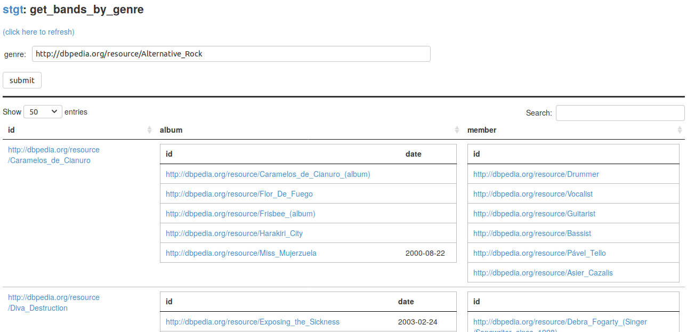

SPARQL Transformer - grlc - Tapas
=================================

This repository contains the files for a study on using [SPARQL
Transformer](https://github.com/D2KLab/sparql-transformer) together with
[grlc](http://grlc.io/) and [Tapas](https://github.com/peta-pico/tapas).

[get_bands_by_genre.json](get_bands_by_genre.json) shows an example of a SPARQL
Transformer query to find the albums and members of bands for a given genre.
When run through grlc and accessed through the Tapas interface, it looks like
this:

You can try out this query and the other queries below through this [Tapas
instance](http://www.tkuhn.eculture.labs.vu.nl/tapas/tapas.html?api=tkuhn/stgt).

For this study the following six queries were used (three nesting levels, each
with a SPARQL Transformer query in JSON and its equivalent SPARQL query):

- Level 0 (no nesting): "Find bands of the genre Experimental Rock with their
  founding years, origins, and homepages"
  - [SPARQL Transformer query](level0-tr.json)
  - [plain SPARQL query](level0-sp.rq)
- Level 1 (1 nesting): "Find bands of the genre Experimental Rock with their
  discography in terms of albums, release dates, and record labels"
  - [SPARQL Transformer query](level1-tr.json)
  - [plain SPARQL query](level1-sp.rq)
- Level 2 (2 nestings): "Find bands of the genre Experimental Rock with their
  discography of albums and their release dates and with a list of their band
  members"
  - [SPARQL Transformer query](level2-tr.json)
  - [plain SPARQL query](level2-sp.rq)

The results for these queries in JSON format can be found
[here](query-results/).

These queries were then used for a user survey, for which you can find the questionnaire
[here](https://github.com/tkuhn/stgt/blob/master/eval/questionnaire-form.md).

The results of this study can be found
[here](https://github.com/tkuhn/stgt/raw/master/eval-results/questionnaire-results.ods).
